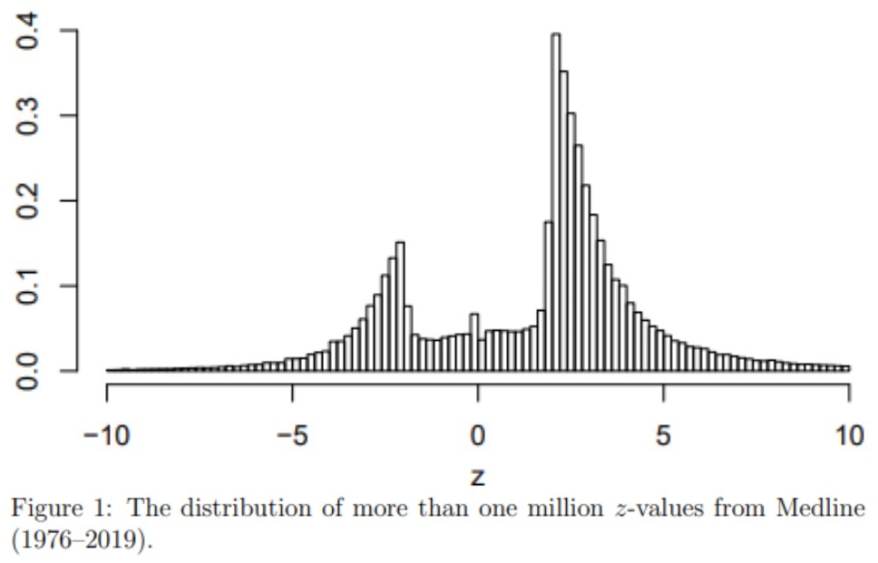
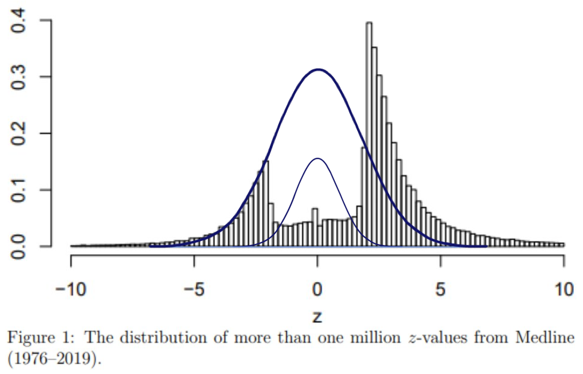

```{r, eval=TRUE, include=TRUE, echo=FALSE, message=FALSE, warning=FALSE}
# regarding `library()`: you don't have to `library(knitr)` if you `knitr::`
knitr::opts_chunk$set(eval=TRUE, include=TRUE, echo=TRUE, message=FALSE, warning=FALSE)

# knitting will default to pdf (rather than, e.g., html)
knitr::opts_chunk$set(dev='pdf')

# Defines a new code chunk `parameter=argument` option which will allow the
# size of printed code+output to be controlled using latex text size names:
# https://www.overleaf.com/learn/latex/Font_sizes%2C_families%2C_and_styles#Reference_guide
def.chunk.hook  <- knitr::knit_hooks$get("chunk")
knitr::knit_hooks$set(chunk = function(x, options) {
  x <- def.chunk.hook(x, options)
  ifelse(options$size != "normalsize", paste0("\n \\", options$size,"\n\n", x, "\n\n \\normalsize"), x)
})

color_block = function(color) {
  function(x, options) sprintf('\\color{%s}\\begin{verbatim}%s\\end{verbatim}',
                               color, x)
}
knitr::knit_hooks$set(message = color_block('red'))
knitr::knit_hooks$set(warning = color_block('red'))
knitr::knit_hooks$set(error = color_block('red'))
```

## Samples Approximate Populations\textcolor{white}{?}

\vspace{.3cm}
```{r, size="footnotesize", fig.width=6, fig.height=2}
library(tidyverse); set.seed(130); n <- 300; support <- seq(-3,3,.01)
normal_pdf <- geom_line(data = tibble(`normal pdf`=dnorm(support), x=support),
                        aes(x=x, y=`normal pdf`))
normal_sample <- geom_histogram(data = tibble(x=rnorm(n=n)), 
                                aes(x=x, y=..density..), bins=30)
# https://r-charts.com/distribution/histogram-density-ggplot2/
# https://stackoverflow.com/questions/16712800/overlay-lines-and-hist-with-ggplot2
ggplot() + normal_sample + normal_pdf + xlim(-4,4) # {r,fig.width=6, fig.height=2}
```


## Samples Approximate Populations\textcolor{white}{?}

\vspace{.3cm}

```{r, size="footnotesize", fig.width=6, fig.height=2}
set.seed(130); n <- 30
normal_pdf <- geom_line(data = tibble(`normal pdf`=dnorm(support), x=support),
                        aes(x=x, y=`normal pdf`))
normal_sample <- geom_histogram(data = tibble(x=rnorm(n=n)), 
                                aes(x=x, y=..density..), bins=15)
# https://r-charts.com/distribution/histogram-density-ggplot2/
# https://stackoverflow.com/questions/16712800/overlay-lines-and-hist-with-ggplot2
ggplot() + normal_sample + normal_pdf + xlim(-4,4) # {r,fig.width=6, fig.height=2}
```

## How Well Do Samples Approximate Populations?

### Clearly samples can't totally approximate populations

but if we're using them to learn population **parameters** it may be "sufficient"...
\huge $$\textcolor{gray}{\text{(statistic) }} \bar x \text{ approximates \textcolor{gray}{(parameter)} } p$$\normalsize
if $x_i$ is only either $0$ or $1$ \textcolor{gray}{\text{(and $p = Pr(x_i=1)$)}}
\huge $$\textcolor{gray}{\text{(statistic) }} \bar x \text{ approximates \textcolor{gray}{(parameter)} } \mu$$
\normalsize
otherwise \textcolor{gray}{\text{(and $\mu = E[x_i]$)}}


## How Well Do Samples Approximate Populations?

:::columns
::::column

```{r, echo=FALSE, fig.width=6, fig.height=2}
support <- seq(-3,3,.01)
normal_pdf <- geom_line(data = tibble(`normal pdf`=dnorm(support), x=support),
                        aes(x=x, y=`normal pdf`))
ggplot() + normal_pdf + xlim(-4,4)
```

::::
::::column

```{r, echo=FALSE, fig.width=6, fig.height=2}
set.seed(130); n <- 30; support <- seq(-3,3,.01)
normal_sample <- geom_histogram(data = tibble(x=rnorm(n=n)), 
                                aes(x=x, y=..density..), bins=15)
ggplot() + normal_sample + xlim(-4,4)
```

::::
:::

```{r, size="footnotesize"}
set.seed(130); n <- 30; x <- rnorm(n=n); N <- 1000#0000000?
population_sample_means <- 1:N; bootstrap_sample_means <- 1:N
set.seed(130); for(i in 1:N){
  population_sample_means[i] <- mean(rnorm(n=n)) 
  bootstrap_sample_means[i] <- mean(sample(x, prob=rep(1/n,n), size=n, replace=TRUE))
} # Does Bootstrap Approximation Work?
```

```{r, echo=FALSE, fig.width=6, fig.height=1.2}
sampling_distribution <- c(population_sample_means, bootstrap_sample_means)
simulation_method <- c(rep("Population Sampling",N),rep("Bootstrap Sampling",N))
tibble(`Sampling Distribution` = sampling_distribution,
       `Simulation\nMethod` = simulation_method) %>% 
  ggplot(aes(x=`Sampling Distribution`, y=`Simulation\nMethod`)) +
  geom_boxplot() + xlab("Sample Mean Sampling Distribution") + xlim(-4,4)
```

## Figure Code

\vspace{.475cm}
```{r, eval=FALSE, echo=TRUE, size="small"}
# {r, include=TRUE, echo=TRUE, fig.width=6, fig.height=1.25}
sampling_distribution <- c(population_sample_means, 
                           bootstrap_sample_means)
simulation_method <- c(rep("Population Sampling",N),
                       rep("Bootstrap Sampling",N))
tibble(`Sampling Distribution` = sampling_distribution,
       `Simulation\nMethod` = simulation_method) %>% 
  ggplot(aes(x=`Sampling Distribution`, y=`Simulation\nMethod`)) +
  geom_boxplot() + xlab("Sample Mean Sampling Distribution") 
# Does Bootstrap Approximation Work?
```

```{r, echo=FALSE, fig.width=6, fig.height=1.25}
sampling_distribution <- c(population_sample_means, bootstrap_sample_means)
simulation_method <- c(rep("Population Sampling",N),rep("Bootstrap Sampling",N))
tibble(`Sampling Distribution` = sampling_distribution,
       `Simulation\nMethod` = simulation_method) %>% 
  ggplot(aes(x=`Sampling Distribution`, y=`Simulation\nMethod`)) +
  geom_boxplot() + xlab("Sample Mean Sampling Distribution") 
```

## How Well Do Samples Approximate Populations?

```{r, echo=FALSE, fig.width=6, fig.height=1.5}
set.seed(4); n <- 30
normal_pdf <- geom_line(data = tibble(`normal pdf`=dnorm(support), x=support),
                        aes(x=x, y=`normal pdf`))
x <- rnorm(n=n)
normal_sample <- geom_histogram(data = tibble(x=x), 
                                aes(x=x, y=..density..), bins=15)
# https://r-charts.com/distribution/histogram-density-ggplot2/
# https://stackoverflow.com/questions/16712800/overlay-lines-and-hist-with-ggplot2
ggplot() + normal_sample + normal_pdf + theme(axis.title.x=element_blank())# {r,fig.width=6, fig.height=2}
```
```{r, echo=FALSE, fig.width=4.5, fig.height=1.6}
population_sample_means <- 1:N; bootstrap_sample_means <- 1:N
set.seed(130); for(i in 1:N){
  population_sample_means[i] <- mean(rnorm(n=n)) 
  bootstrap_sample_means[i] <- mean(sample(x, prob=rep(1/n,n), size=n, replace=TRUE))
} # Does Bootstrap Approximation Work?
sampling_distribution <- c(population_sample_means, bootstrap_sample_means)
simulation_method <- c(rep("Population Sampling",N),rep("Bootstrap Sampling",N))
tibble(`Sampling Distribution` = sampling_distribution,
       `Simulation\nMethod` = simulation_method) %>% 
  ggplot(aes(x=`Sampling Distribution`, y=`Simulation\nMethod`)) +
  geom_boxplot() + xlab("Sample Mean Sampling Distribution") + xlim(-1.75,2)
```

## How Well Do Samples Approximate Populations?

```{r, echo=FALSE, fig.width=6, fig.height=1.5}
set.seed(4); n <- 30
normal_pdf <- geom_line(data = tibble(`normal pdf`=dnorm(support), x=support),
                        aes(x=x, y=`normal pdf`))
x <- rnorm(n=n)
normal_sample <- geom_histogram(data = tibble(x=x), 
                                aes(x=x, y=..density..), bins=15)
# https://r-charts.com/distribution/histogram-density-ggplot2/
# https://stackoverflow.com/questions/16712800/overlay-lines-and-hist-with-ggplot2
ggplot() + normal_sample + normal_pdf + theme(axis.title.x=element_blank()) # {r,fig.width=6, fig.height=2}
```
```{r, echo=FALSE, fig.width=4.5, fig.height=1.6}
population_sample_means <- 1:N; bootstrap_sample_means <- 1:N
set.seed(130); for(i in 1:N){
  population_sample_means[i] <- mean(rnorm(n=n)) 
  bootstrap_sample_means[i] <- mean(sample(x, prob=rep(1/n,n), size=n, replace=TRUE))
} # Does Bootstrap Approximation Work?
sampling_distribution <- c(population_sample_means, bootstrap_sample_means)
simulation_method <- c(rep("Population Sampling",N),rep("Bootstrap Sampling",N))
tibble(`Sampling Distribution` = sampling_distribution,
       `Simulation\nMethod` = simulation_method) %>% 
  ggplot(aes(x=`Sampling Distribution`, y=`Simulation\nMethod`)) +
  geom_boxplot() + xlab("Sample Mean Sampling Distribution")
```

## How Well Do Samples Approximate Populations?

```{r, echo=FALSE, fig.width=6, fig.height=1.5}
set.seed(13); n <- 30
normal_pdf <- geom_line(data = tibble(`normal pdf`=dnorm(support), x=support),
                        aes(x=x, y=`normal pdf`))
x <- rnorm(n=n)
normal_sample <- geom_histogram(data = tibble(x=x), 
                                aes(x=x, y=..density..), bins=15)
# https://r-charts.com/distribution/histogram-density-ggplot2/
# https://stackoverflow.com/questions/16712800/overlay-lines-and-hist-with-ggplot2
ggplot() + normal_sample + normal_pdf + theme(axis.title.x=element_blank()) # {r,fig.width=6, fig.height=2}
```
```{r, echo=FALSE, fig.width=4.5, fig.height=1.6}
population_sample_means <- 1:N; bootstrap_sample_means <- 1:N
set.seed(130); for(i in 1:N){
  population_sample_means[i] <- mean(rnorm(n=n)) 
  bootstrap_sample_means[i] <- mean(sample(x, prob=rep(1/n,n), size=n, replace=TRUE))
} # Does Bootstrap Approximation Work?
sampling_distribution <- c(population_sample_means, bootstrap_sample_means)
simulation_method <- c(rep("Population Sampling",N),rep("Bootstrap Sampling",N))
tibble(`Sampling Distribution` = sampling_distribution,
       `Simulation\nMethod` = simulation_method) %>% 
  ggplot(aes(x=`Sampling Distribution`, y=`Simulation\nMethod`)) +
  geom_boxplot() + xlab("Sample Mean Sampling Distribution") + xlim(-1.75,2)
```

## How Well Do Samples Approximate Populations?

```{r, echo=FALSE, fig.width=6, fig.height=1.5}
set.seed(13); n <- 30
normal_pdf <- geom_line(data = tibble(`normal pdf`=dnorm(support), x=support),
                        aes(x=x, y=`normal pdf`))
x <- rnorm(n=n)
normal_sample <- geom_histogram(data = tibble(x=x), 
                                aes(x=x, y=..density..), bins=15)
# https://r-charts.com/distribution/histogram-density-ggplot2/
# https://stackoverflow.com/questions/16712800/overlay-lines-and-hist-with-ggplot2
ggplot() + normal_sample + normal_pdf + theme(axis.title.x=element_blank()) # {r,fig.width=6, fig.height=2}
```
```{r, echo=FALSE, fig.width=4.5, fig.height=1.6}
population_sample_means <- 1:N; bootstrap_sample_means <- 1:N
set.seed(130); for(i in 1:N){
  population_sample_means[i] <- mean(rnorm(n=n)) 
  bootstrap_sample_means[i] <- mean(sample(x, prob=rep(1/n,n), size=n, replace=TRUE))
} # Does Bootstrap Approximation Work?
sampling_distribution <- c(population_sample_means, bootstrap_sample_means)
simulation_method <- c(rep("Population Sampling",N),rep("Bootstrap Sampling",N))
tibble(`Sampling Distribution` = sampling_distribution,
       `Simulation\nMethod` = simulation_method) %>% 
  ggplot(aes(x=`Sampling Distribution`, y=`Simulation\nMethod`)) +
  geom_boxplot() + xlab("Sample Mean Sampling Distribution") 
```

## How Well Do Samples Approximate Populations?

```{r, echo=FALSE, fig.width=6, fig.height=1.5}
set.seed(10); n <- 30
normal_pdf <- geom_line(data = tibble(`normal pdf`=dnorm(support), x=support),
                        aes(x=x, y=`normal pdf`))
x <- rnorm(n=n)
normal_sample <- geom_histogram(data = tibble(x=x), 
                                aes(x=x, y=..density..), bins=15)
# https://r-charts.com/distribution/histogram-density-ggplot2/
# https://stackoverflow.com/questions/16712800/overlay-lines-and-hist-with-ggplot2
ggplot() + normal_sample + normal_pdf + theme(axis.title.x=element_blank()) # {r,fig.width=6, fig.height=2}
```
```{r, echo=FALSE, fig.width=4.5, fig.height=1.6}
population_sample_means <- 1:N; bootstrap_sample_means <- 1:N
set.seed(130); for(i in 1:N){
  population_sample_means[i] <- mean(rnorm(n=n)) 
  bootstrap_sample_means[i] <- mean(sample(x, prob=rep(1/n,n), size=n, replace=TRUE))
} # Does Bootstrap Approximation Work?
sampling_distribution <- c(population_sample_means, bootstrap_sample_means)
simulation_method <- c(rep("Population Sampling",N),rep("Bootstrap Sampling",N))
tibble(`Sampling Distribution` = sampling_distribution,
       `Simulation\nMethod` = simulation_method) %>% 
  ggplot(aes(x=`Sampling Distribution`, y=`Simulation\nMethod`)) +
  geom_boxplot() + xlab("Sample Mean Sampling Distribution") + xlim(-1.75,2)
```

## How Well Do Samples Approximate Populations?

```{r, echo=FALSE, fig.width=6, fig.height=1.5}
set.seed(10); n <- 30
normal_pdf <- geom_line(data = tibble(`normal pdf`=dnorm(support), x=support),
                        aes(x=x, y=`normal pdf`))
x <- rnorm(n=n)
normal_sample <- geom_histogram(data = tibble(x=x), 
                                aes(x=x, y=..density..), bins=15)
# https://r-charts.com/distribution/histogram-density-ggplot2/
# https://stackoverflow.com/questions/16712800/overlay-lines-and-hist-with-ggplot2
ggplot() + normal_sample + normal_pdf + theme(axis.title.x=element_blank()) # {r,fig.width=6, fig.height=2}
```
```{r, echo=FALSE, fig.width=4.5, fig.height=1.6}
population_sample_means <- 1:N; bootstrap_sample_means <- 1:N
set.seed(130); for(i in 1:N){
  population_sample_means[i] <- mean(rnorm(n=n)) 
  bootstrap_sample_means[i] <- mean(sample(x, prob=rep(1/n,n), size=n, replace=TRUE))
} # Does Bootstrap Approximation Work?
sampling_distribution <- c(population_sample_means, bootstrap_sample_means)
simulation_method <- c(rep("Population Sampling",N),rep("Bootstrap Sampling",N))
tibble(`Sampling Distribution` = sampling_distribution,
       `Simulation\nMethod` = simulation_method) %>% 
  ggplot(aes(x=`Sampling Distribution`, y=`Simulation\nMethod`)) +
  geom_boxplot() + xlab("Sample Mean Sampling Distribution") 
```

## Sanity Check

1. What is $x_i$?
2. What is the **population** of $x_i$?
3. What is a parameter? 
4. What is the sample `x = c(x_1,x_2,...x_n)`?
5. What makes the sample a better approximation of the population?
6. What happens if you get a "bad" sample? Can anything be done about this?
7. What is a statistic?
8. What is $\bar x$?
9. What is the **sampling distribution** of $\bar x$?
10. How is the **sampling distribution** of $\bar x$ created?

## How Well Do Samples Approximate Populations?

:::columns
::::column
```{r, eval=FALSE, size="footnotesize"}
plot<-ggplot();mu<-0; n<-30;set.seed(130)
for(i in 1:R){
  x <- rnorm(mean=mu, n=n)
  bootstrap_xbar <- 1:N
  for(j in 1:N){
    tmp <- sample(x, replace=TRUE)
    bootstrap_xbars[j] <- mean(tmp)
  } 
  ConfidenceInterval <- 
    quantile(bootstrap_xbars, percentiles)
  if( all(ConfidenceInterval < mu) | 
      all(ConfidenceInterval > mu) ){
      col="red"}else{col="black"}
  plot <- plot + geom_line(color = col,
    data = tibble(x=ConfidenceInterval,
      y=c(i,i)), aes(x=x, y=y))
}; plot+xlab("Population Mean")+labs(title=
  paste(R, " ", (1-2*half_alpha)*100, 
        "% Confidence Intervals", sep=""))+                                     
  theme(axis.title.y=element_blank())
```
::::
::::column
```{r, eval=FALSE, size="footnotesize"}

half_alpha <- 0.025; R <- 100; N <- 1000#00?
percentiles <- c(half_alpha, 1-half_alpha)
```
```{r, echo=FALSE, size="footnotesize", fig.height=3, fig.width=3}
mu <- 0; R <- 100; N <- 1000#0000?
half_alpha <- 0.025
percentiles <- c(half_alpha, 1-half_alpha)
plot <- ggplot(); set.seed(130)
for(i in 1:R){
  x <- rnorm(mean=mu, n=n)
  bootstrap_xbars <- 1:N
  for(j in 1:N){
    tmp <- sample(x, replace=TRUE)
    bootstrap_xbars[j] <- mean(tmp)
  }
  ConfidenceInterval <- 
    quantile(bootstrap_xbars, percentiles)
  if( all(ConfidenceInterval < mu) | 
      all(ConfidenceInterval > mu) ){
      col="red"}else{col="black"}
  plot <- plot + geom_line(color = col, 
    data = tibble(x=ConfidenceInterval,
                  y=c(i,i)), aes(x=x, y=y))
}; plot+xlab("Population Mean")+labs(title=
  paste(R, " ", (1-2*half_alpha)*100, 
        "% Confidence Intervals", sep=""))+                                     
  theme(axis.title.y=element_blank())
```
::::
:::

## How Well Do Samples Approximate Populations?

:::columns
::::column
```{r, eval=FALSE, size="footnotesize"}
plot<-ggplot();mu<-0; n<-30;set.seed(130)
for(i in 1:R){
  x <- rnorm(mean=mu, n=n)
  bootstrap_xbar <- 1:N
  for(j in 1:N){
    tmp <- sample(x, replace=TRUE)
    bootstrap_xbars[j] <- mean(tmp)
  } 
  ConfidenceInterval <- 
    quantile(bootstrap_xbars, percentiles)
  if( all(ConfidenceInterval < mu) | 
      all(ConfidenceInterval > mu) ){
      col="red"}else{col="black"}
  plot <- plot + geom_line(color = col,
    data = tibble(x=ConfidenceInterval,
      y=c(i,i)), aes(x=x, y=y))
}; plot+xlab("Population Mean")+labs(title=
  paste(R, " ", (1-2*half_alpha)*100, 
        "% Confidence Intervals", sep=""))+                                     
  theme(axis.title.y=element_blank())
```
::::
::::column
```{r, eval=FALSE, size="footnotesize"}

half_alpha <- 0.05; R <- 100; N <- 1000#00?
percentiles <- c(half_alpha, 1-half_alpha)
```
```{r, echo=FALSE, size="footnotesize", fig.height=3, fig.width=3}
mu <- 0; R <- 100; N <- 1000#0000?
half_alpha <- 0.05
percentiles <- c(half_alpha, 1-half_alpha)
plot <- ggplot(); set.seed(130)
for(i in 1:R){
  x <- rnorm(mean=mu, n=n)
  bootstrap_xbars <- 1:N
  for(j in 1:N){
    tmp <- sample(x, replace=TRUE)
    bootstrap_xbars[j] <- mean(tmp)
  }
  ConfidenceInterval <- 
    quantile(bootstrap_xbars, percentiles)
  if( all(ConfidenceInterval < mu) | 
      all(ConfidenceInterval > mu) ){
      col="red"}else{col="black"}
  plot <- plot + geom_line(color = col, 
    data = tibble(x=ConfidenceInterval,
                  y=c(i,i)), aes(x=x, y=y))
}; plot+xlab("Population Mean")+labs(title=
  paste(R, " ", (1-2*half_alpha)*100, 
        "% Confidence Intervals", sep=""))+                                     
  theme(axis.title.y=element_blank())
```
::::
:::


## How Well Do Samples Approximate Populations?

:::columns
::::column
```{r, eval=FALSE, size="footnotesize"}
plot<-ggplot();mu<-0; n<-30;set.seed(130)
for(i in 1:R){
  x <- rnorm(mean=mu, n=n)
  bootstrap_xbar <- 1:N
  for(j in 1:N){
    tmp <- sample(x, replace=TRUE)
    bootstrap_xbars[j] <- mean(tmp)
  } 
  ConfidenceInterval <- 
    quantile(bootstrap_xbars, percentiles)
  if( all(ConfidenceInterval < mu) | 
      all(ConfidenceInterval > mu) ){
      col="red"}else{col="black"}
  plot <- plot + geom_line(color = col,
    data = tibble(x=ConfidenceInterval,
      y=c(i,i)), aes(x=x, y=y))
}; plot+xlab("Population Mean")+labs(title=
  paste(R, " ", (1-2*half_alpha)*100, 
        "% Confidence Intervals", sep=""))+                                     
  theme(axis.title.y=element_blank())
```
::::
::::column
```{r, eval=FALSE, size="footnotesize"}

half_alpha <- 0.1; R <- 100; N <- 1000#00?
percentiles <- c(half_alpha, 1-half_alpha)
```
```{r, echo=FALSE, size="footnotesize", fig.height=3, fig.width=3}
mu <- 0; R <- 100; N <- 1000#0000?
half_alpha <- 0.1
percentiles <- c(half_alpha, 1-half_alpha)
plot <- ggplot(); set.seed(130)
for(i in 1:R){
  x <- rnorm(mean=mu, n=n)
  bootstrap_xbars <- 1:N
  for(j in 1:N){
    tmp <- sample(x, replace=TRUE)
    bootstrap_xbars[j] <- mean(tmp)
  }
  ConfidenceInterval <- 
    quantile(bootstrap_xbars, percentiles)
  if( all(ConfidenceInterval < mu) | 
      all(ConfidenceInterval > mu) ){
      col="red"}else{col="black"}
  plot <- plot + geom_line(color = col, 
    data = tibble(x=ConfidenceInterval,
                  y=c(i,i)), aes(x=x, y=y))
}; plot+xlab("Population Mean")+labs(title=
  paste(R, " ", (1-2*half_alpha)*100, 
        "% Confidence Intervals", sep=""))+                                     
  theme(axis.title.y=element_blank())
```
::::
:::

## Sanity Check

1. What is the "population" when bootstrapping a sampling distribution?
2. Should `replace=TRUE` or `replace=FALSE` when bootstrapping with `sample()`?
3. Why would we use the `quantile()` function in the bootstrapping context?
4. What value of the `probs` parameter gives a 90% confidence intervals?
5. How does the confidence level relate to the width of the Confidence Intervals?
6. Are there one or two `for` loops when we're bootstrapping a confidence interval?
7. Why?

## Statistical Grammar Police

\begin{block}{For a 95\% Confidence Interval we say}
we have 95\% \textbf{Confidence} the true parameter value is contained in the Interval
\end{block}

- We use the term **Confidence** (as opposed to *probability* or *chance*) to
intentionally signal that this is a **Confidence Interval** formulation.

- We **DO NOT** want to say there's a 95% probability (or chance) that
 the true parameter value will be contained in some some interval. 

  - This **might** be misinterpreted as saying that the true parameter is usually in the interval but sometimes not; but parameters are only just in the interval or not*
  
\vspace{.1in}

### Are we just splitting hairs here?

The chance the constructed confidence interval bounds the true parameter value is 95%


## Using Confidence Intervals

### Do we need formal Hypotheses? Can actionable decisions be made with these?

```{r, echo=FALSE, fig.width=5.5, fig.height=2.5}
ggplot() + xlim(c(0,1)) + ylim(c(0,5)) +
  labs(title="95% Confidence Intervals of Proportion of People who Agree") +
  geom_line(data=tibble(x=c(.33,1), y=c(1,1)), aes(x=x,y=y), size=3) +
  geom_line(data=tibble(x=c(.6,1), y=c(2,2)), aes(x=x,y=y), size=3) +
  geom_line(data=tibble(x=c(.8,1), y=c(3,3)), aes(x=x,y=y), size=3) +  
  geom_line(data=tibble(x=c(.95,1), y=c(4,4)), aes(x=x,y=y), size=3) +
  xlab("Could you interpret these and use them to make decisions?")
```


## Confidence Intervals VS Hypothesis Testing

\vspace{.2in}

\begin{block}{\emph{STATISTICAL INFERENCE}: Parameter \emph{ESTIMATION}}
$\alpha$-significance level \textbf{Hypothesis Testing} formally rejects implausible parameter values
\vspace{.1cm}
\begin{itemize}
\item \emph{What if we'd instead like to provide a range of plausible parameter values?}
\end{itemize}
\end{block}

At a fixed confidence level,

\vspace{-.25cm}
narrower intervals are more meaningful and therefore more likely actionable.

- "We have '95% Confidence' that anywhere between 1% to 99% of people agree!"

\vspace{.25cm}

### How Do We Get Tighter Confidence Intervals: ? 

We previously saw that for the same data

- 80% Confidence Intervals are narrower than
  - 90% Confidence Intervals, which are narrower than
    - 95% Confidence Intervals, which are narrower than...

\vspace{-.2in}
$\quad\quad\quad\quad\quad\quad\quad\quad\quad\quad\quad\quad\quad\quad\quad\quad\quad\quad\quad\quad\quad\quad\quad\quad\quad\quad\quad\quad$*This won't really*

\vspace{-.05in}
$\quad\quad\quad\quad\quad\quad\quad\quad\quad\quad\quad\quad\quad\quad\quad\quad\quad\quad\quad\quad\quad\quad\quad\quad\quad\quad\quad\quad$*help us though...*

\vspace{.1in}


## Sanity Check

So what's the difference between Confidence Intervals and Hypothesis Tests?

1. What are the different "use cases" for each?
2. Which one gives *Estimation*?
3. Are they both *Inference*?
4. Can both be use to make decisions?
5. How so?
6. When are these decisions more power/useful/trustworthy/actionable?

## How Do We Get Tighter Confidence Intervals? $n$

```{r, echo=FALSE}
R <- 100; N <- 1000#00?
half_alpha <- 0.025; percentiles <- c(half_alpha, 1-half_alpha)
set.seed(130); results <- tibble(n=c(),`Confidence Interval Widths`=c())
for(n in seq(5,100,5)){
  ConfidenceIntervalWidth <- 1:R
  for(i in 1:R){
    x <- rnorm(n=n)
    bootstrap_xbars <- 1:N
    for(j in 1:N){
      bootstrap_xbars[j] <- mean(sample(x, replace=TRUE))
    }  
    ConfidenceInterval <- quantile(bootstrap_xbars, percentiles) 
    ConfidenceIntervalWidth[i] <- ConfidenceInterval %>% diff()
  }
  results <- results %>% 
    bind_rows(tibble(n=rep(as.character(n),R),
                     `Confidence Interval Widths`=ConfidenceIntervalWidth))
}
```
```{r, echo=FALSE, fig.width=7, fig.height=3}
#https://stackoverflow.com/questions/64112211/how-to-get-the-correct-order-on-the-x-axis
results$n <- factor(results$n, levels=seq(5,100,5))
# https://dplyr.tidyverse.org/reference/bind
results %>% ggplot(aes(x=n, y=`Confidence Interval Widths`)) +
  geom_boxplot() + labs(title="Distribution of 95% Confidence Interval Widths for 100 Confidence Intervals")
```

<!-- https://www.zoology.ubc.ca/~whitlock/Kingfisher/KFTeachingNotes.htm -->
<!-- https://onlinestatbook.com/stat_sim/sampling_dist/ -->
<!-- googled "sampling distribution sample size app" or something like that -->

https://www.zoology.ubc.ca/~whitlock/Kingfisher/CLT.htm


## The Sampling Distribution of $\bar x$ VS Skewness

:::columns
::::column

```{r, echo=FALSE, fig.width=6, fig.height=1.9}
support <- seq(-3,3,.01)
normal_pdf <- geom_line(data = tibble(`normal pdf`=dnorm(support), x=support),
                        aes(x=x, y=`normal pdf`))
ggplot() + normal_pdf 
```
\vspace{-.65cm}
```{r, echo=FALSE, fig.width=3, fig.height=1.1}
n <- 3; N <- 10000
x_bar_sampling_distribution <- 1:N
for(i in 1:N){
  x_bar_sampling_distribution[i] <- mean(rnorm(n=n))
}
tibble(x=x_bar_sampling_distribution) %>% ggplot() + 
  geom_histogram(aes(x=x, y=..density..)) + xlim(c(-3,3)) +
  ylab(paste("n =", n))
```
\vspace{-.65cm}
```{r, echo=FALSE, fig.width=3, fig.height=1.1}
n <- 7; N <- 10000
x_bar_sampling_distribution <- 1:N
for(i in 1:N){
  x_bar_sampling_distribution[i] <- mean(rnorm(n=n))
}
tibble(x=x_bar_sampling_distribution) %>% ggplot() + 
  geom_histogram(aes(x=x, y=..density..)) + xlim(c(-3,3)) +
  ylab(paste("n =", n))
```
\vspace{-.65cm}
```{r, echo=FALSE, fig.width=3, fig.height=1.1}
n <- 20; N <- 10000
x_bar_sampling_distribution <- 1:N
for(i in 1:N){
  x_bar_sampling_distribution[i] <- mean(rnorm(n=n))
}
tibble(x=x_bar_sampling_distribution) %>% ggplot() + 
  geom_histogram(aes(x=x, y=..density..)) + xlim(c(-3,3)) +
  ylab(paste("n =", n))
```

::::
::::column


```{r, echo=FALSE, fig.width=6, fig.height=1.9}
support <- seq(0,6,.01)
exponential_pdf <- geom_line(data = tibble(`normal pdf`=dexp(support), x=support),
                        aes(x=x, y=`normal pdf`))
ggplot() + exponential_pdf 
```
\vspace{-.65cm}
```{r, echo=FALSE, fig.width=3, fig.height=1.1}
n <- 3; N <- 10000
x_bar_sampling_distribution <- 1:N
for(i in 1:N){
  x_bar_sampling_distribution[i] <- mean(rexp(n=n))
}
tibble(x=x_bar_sampling_distribution) %>% ggplot() + 
  geom_histogram(aes(x=x, y=..density..)) + xlim(c(0,6)) +
  ylab(paste("n =", n))
```
\vspace{-.65cm}
```{r, echo=FALSE, fig.width=3, fig.height=1.1}
n <- 7; N <- 10000
x_bar_sampling_distribution <- 1:N
for(i in 1:N){
  x_bar_sampling_distribution[i] <- mean(rexp(n=n))
}
tibble(x=x_bar_sampling_distribution) %>% ggplot() + 
  geom_histogram(aes(x=x, y=..density..)) + xlim(c(0,6)) +
  ylab(paste("n =", n))
```
\vspace{-.65cm}
```{r, echo=FALSE, fig.width=3, fig.height=1.1}
n <- 20; N <- 10000
x_bar_sampling_distribution <- 1:N
for(i in 1:N){
  x_bar_sampling_distribution[i] <- mean(rexp(n=n))
}
tibble(x=x_bar_sampling_distribution) %>% ggplot() + 
  geom_histogram(aes(x=x, y=..density..)) + xlim(c(0,6)) +
  ylab(paste("n =", n))
```

::::
:::

## Confidence Intervals VS Hypothesis Testing

:::columns
::::column

### Confidence Intervals $[\hat \mu_{lower}, \hat \mu_{upper}]$

\vspace{.15cm}

1. **Approximate** population as sample
2. Bootstrap **sampling distribution**
3. Define Confidence Interval with sampling distribution percentiles

\vspace{.15cm}
**$[(1-\alpha)\times100]$% Confidence Interval**

\vspace{.15cm}
- $\alpha$ chance the confidence interval does not bound the true parameter value

\vspace{.15cm}
- This is not $Pr(\mu \in [\hat \mu_{lower}, \hat \mu_{upper}])$, it is
$Pr([\hat \mu_{lower}, \hat \mu_{upper}] \text{ bounds } \mu)$

\vspace{.15cm}
- \textbf{*}True $\mu$ isn't a random thing, but $[\hat \mu_{lower}, \hat \mu_{upper}]$ based on the sample is

::::
::::column

### Hypothesis Testing $H_0: \mu = \mu_0 \vphantom{\hat \mu_{upper}]}$

\vspace{.15cm}

1. **Assume** a population through $H_0$
2. Get **sampling distribution** under $H_0$
3. Compute the sample p-value and either Reject or Fail to Reject $H_0$

\vspace{.15cm}
**$\alpha$-level significance testing**

\vspace{.15cm}
- $\alpha$ chance of a Type I Error if $H_0$ rejected for a p-value smaller than $\alpha$

\vspace{.15cm}
- p-values are neither $Pr(H_0 \text{ is } \texttt{TRUE})$ nor $Pr(\mu = \mu_0)$

\vspace{.15cm}
- \textbf{*}True $\mu$ and hence $H_0$ aren't random things, but sample-based p-values are
::::
:::

## Sanity Check

For a 95% Confidence Interval and $\alpha$-level significance test

1. What is the probability $\mu \in [\hat \mu_{lower}, \hat \mu_{upper}]$
2. What is the probability that $[\hat \mu_{lower}, \hat \mu_{upper}] \text{ bounds } \mu$?
3. What is $Pr(H_0 \text{ is } \texttt{TRUE})$?
4. What is $Pr(\mu = \mu_0)$?
5. What is the p-value?
6. What is the role of the test statistic, parameter, population, and sampling distribution relative to the *p-value*? And how about for a *confidence interval*?

## The p-value ConTROVersy/ContraVersy

```{r, eval=FALSE, include=FALSE}
download.file(url = "https://i.imgflip.com/1mt8h2.jpg",
              destfile = "images/will.jpg", mode = 'wb')
```


:::columns
::::column

- [Why are p-values controversial?](https://www.tandfonline.com/doi/full/10.1080/00031305.2016.1277161) 
- [What a nerdy debate about p-values shows about science and how to fix it](https://www.vox.com/science-and-health/2017/7/31/16021654/p-values-statistical-significance-redefine-0005)
- [The reign of the p-value is over: what alternative analyses could we employ to fill the power vacuum?](https://royalsocietypublishing.org/doi/10.1098/rsbl.2019.0174)
- [Scientists rise up against statistical significance](https://www.nature.com/articles/d41586-019-00857-9)
- [Statistics experts urge scientists to rethink the p-value](https://www.spectrumnews.org/news/statistics-experts-urge-scientists-rethink-p-value)

::::
::::column

{width=175px}

::::
:::

The main problem is wrongly interpreting p-values as $Pr(H_0 \text{ is } \texttt{TRUE})$
and $Pr(\mu = \mu_0)$

### but the deeper problems with p-values are 

- introduced [here](https://www2.stat.duke.edu/~berger/p-values.html) and presented [here](https://www.jarad.me/courses/stat587Eng/slides/Inference/I06-Pvalues/why_pvalues_dont_mean_what_you_think_they_mean.pdf)
- and rely upon understanding the simulation [here](https://jaradniemi.shinyapps.io/pvalue/)

## The p-value ConTROVersy/ContraVersy

|{height=2.5in}|
|-|
|https://twitter.com/fmg_twtr/status/1334884184675012609|

## The p-value ConTROVersy/ContraVersy

|{height=2.5in}|
|-|
|https://twitter.com/fmg_twtr/status/1334884184675012609|


## The p-value ConTROVersy/ContraVersy

```{r, eval=FALSE, include=FALSE}
download.file(url = "https://getlighthouse.com/blog/wp-content/uploads/2014/09/Break-the-Cycle-1.png",
              destfile = "images/cycle.png", mode = 'wb')
```

### George Cobb, Professor Emeritus, Mount Holyoke College

*Q: Why do colleges/grad schools use $\alpha = 0.05$ thresholds for statistical significance?*

**A: Because that's still what the scientific community and journal editors use.**

*Q: Why do so many people use $\alpha = 0.05$ thresholds for statistical significance?*

**A: Because that's what they were taught in college or grad school.**

$\alpha = 0.05$ is arbitrary: better to either simply comment on the strength of the evidence against $H_0$ by reporting the p-value (or at least choose $\alpha$ before calculating the p-value)


:::columns
::::column

| |
|-|
|{height=100px}|

::::
::::column

|p-value| evidence against $H_0$|
|-|-|
|above 0.1| None |
|0.05 to 0.1| Weak |
|0.01 to 0.05 | Moderate |
|0.0001 to 0.01 | Strong |
|below 0.0001 | Very Strong |

::::
:::


## FIX The p-value ConTROVersy/ContraVersy

0. Don't interpret p-values as $Pr(H_0 \text{ is } \texttt{TRUE})$
or $Pr(\mu = \mu_0)$:

   p-values are the probability of observing a test statistic that is
   *as or more extreme* than the one we got **if the NULL Hypothesis was actually `TRUE`**

1. Want to control Type I error? Set $\alpha$ and do a $\alpha$-significance test

2. Want to use a "measure of evidence" perspective without controlling Type I error? 

   Don't retroactively interpret p-value in terms of Type I error, and instead, say

\small
| | | | | | |
|-|-|-|-|-|-|
|p-value |above 0.1 |0.05 to 0.1| 0.01 to 0.05 | 0.0001 to 0.01 | below 0.0001 |
| evidence against $H_0$ |None | Weak | Moderate | Strong | Very Strong |

\vspace{-.25cm}
\normalsize
3. Or, use a **Confidence Interval**: get BOTH the estimate *AND* its strength. \textcolor{gray}{How?}

## Winning

```{r, eval=FALSE, include=FALSE}
download.file(url = "https://i.pinimg.com/originals/eb/8f/d2/eb8fd20647c0b7c722c1dd935be8bc03.jpg",
              destfile = "images/winning.jpg", mode = 'wb')
download.file(url = "https://www.memecreator.org/static/images/memes/4952590.jpg",
              destfile = "images/winning2.jpg", mode = 'wb')
```

| {height=2in} | {height=2in} | 
|-|-|


## FIX The p-value ConTROVersy/ContraVersy

### Do we need formal Hypotheses? Can actionable decisions be made with these?

```{r, echo=FALSE, fig.width=5.5, fig.height=2.5}
ggplot() + xlim(c(0,1)) + ylim(c(0,5)) +
  labs(title="95% Confidence Intervals of Proportion of People who Agree") +
  geom_line(data=tibble(x=c(.33,1), y=c(1,1)), aes(x=x,y=y), size=3) +
  geom_line(data=tibble(x=c(.6,1), y=c(2,2)), aes(x=x,y=y), size=3) +
  geom_line(data=tibble(x=c(.8,1), y=c(3,3)), aes(x=x,y=y), size=3) +  
  geom_line(data=tibble(x=c(.95,1), y=c(4,4)), aes(x=x,y=y), size=3) +
  xlab("Could you interpret these and use them to make decisions?")
```


## Sanity Check

- True/False: If you have relevant data for each individual in the population, you can calculate the true value of parameters.
- True/False: In general, we know the true value of parameters.
- True/False: We only know the true value of parameters when we're doing Hypothesis Testing, not when we're estimating them with Confidence Intervals.
- True/False: A statistic is calculated from observed data and is an estimate of a true parameter value.
- True/False: Every random sample drawn from the population will yield the same values for statistics.
